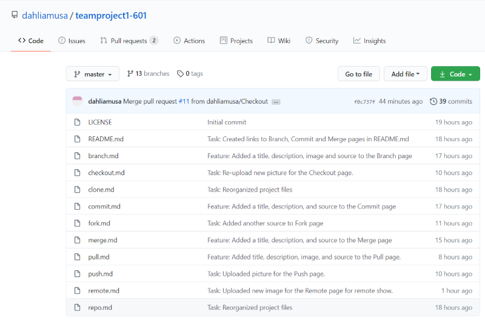

# Master Branch

When creating a new [repository](/gitcommands/repo.md), the default branch name in Git is **master**. This serves as your master branch as the main branch where all changes will be ultimately merged into and is the production version of the project. Therefore, it is highly recommended not to make changes directly to the master branch, especially when working with collaborators. By creating branches off the master, it allows the users to experiment the changes before merging it with the master branch.

Sources:
* [Master Branch](https://thenewstack.io/dont-mess-with-the-master-working-with-branches-in-git-and-github/)

