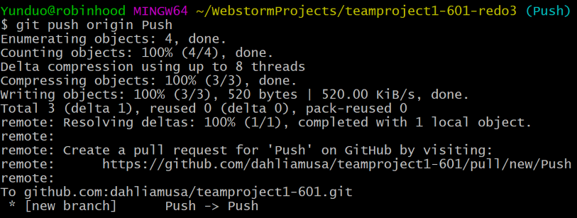

# Push

A **push** is a command that pushes commits from a local branch to a remote repository. This can be done by using the command `git push`. It is the equivalent of updating or publishing. Pushing the changes to the remote repository allows your commits to become accessible to other collaborators.

Sources:
* [Git Push](https://github.com/git-guides/git-push)