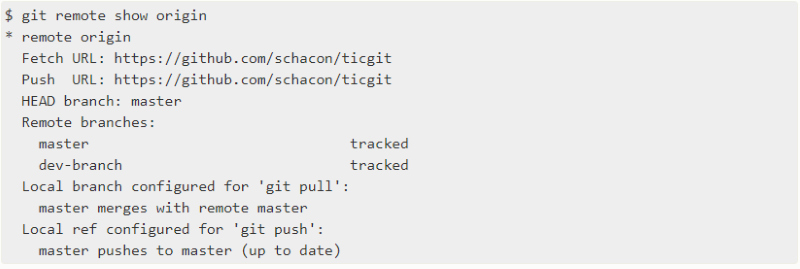
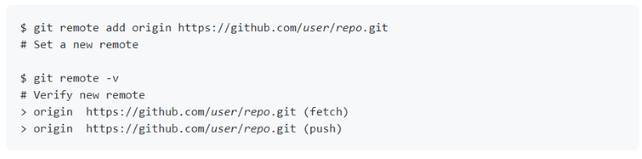
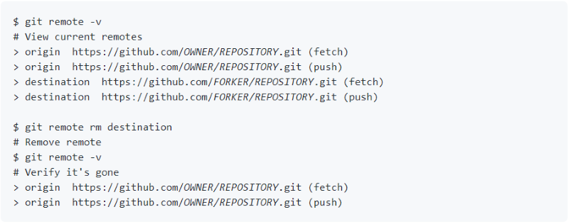

# Remote

The **remote** command allows users to manage connections to remote repositories. There are three remote commands that are often used, remote show, remote add, and remote remove. 

## Remote Show
The command `git remote show` shows the URLs of the remote repositories when listing your current remote connection. It can also be shorthanded by the command `git remote -v`.

## Remote Add
The command `git remote add` adds a new remote connection to the directory of the repository.

## Remote Remove
The command `git remote rm` is used to remove a remote URL from the repository.

Sources:
* [Git Remote Show](https://git-scm.com/book/en/v2/Git-Basics-Working-with-Remotes)
* [Git Remote Add](https://docs.github.com/en/github/using-git/adding-a-remote)
* [Git Remote Remove](https://docs.github.com/en/github/using-git/removing-a-remote)
