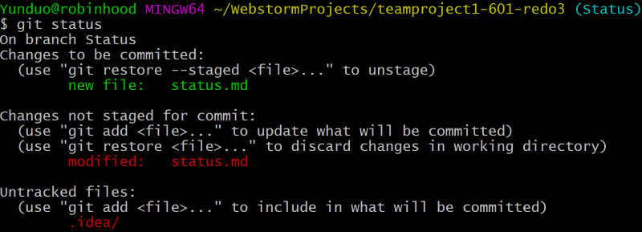
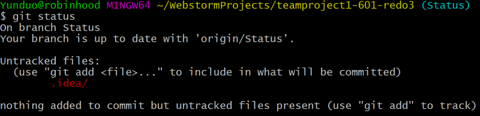

# Status

The **status** of the working tree can be shown by using the command `git status`. This is useful information as it can show the state of the working directory, and the files that are untracked by Git. If all files are tracked, then it will show that the branch is up to date with the master and there is nothing else to commit. 

*Before Commit*

*After Commit*

Sources:
* [Git Status](https://www.atlassian.com/git/tutorials/inspecting-a-repository#:~:text=The%20git%20status%20command%20displays,regarding%20the%20committed%20project%20history.)
